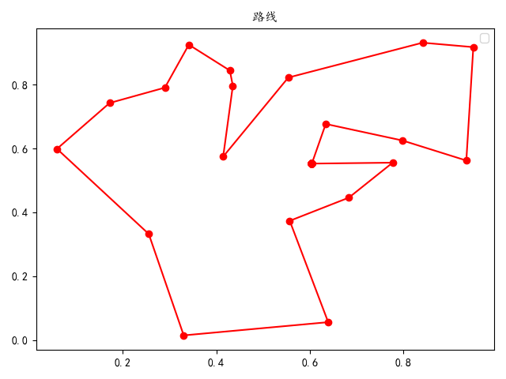
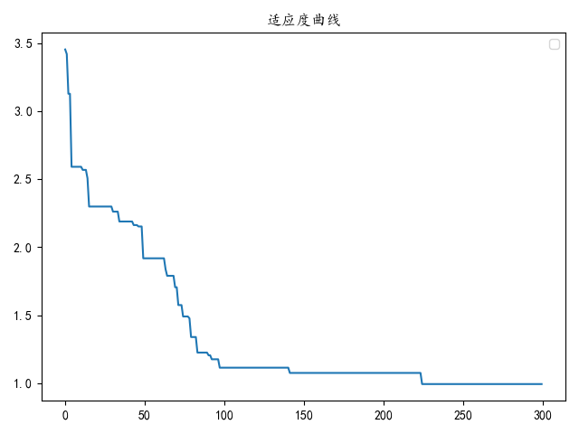

# 遗传算法解决旅行商（TSP）问题
## 视频地址
<https://www.bilibili.com/video/BV17Z4y1w7qF>
## 效果
* 输入：
```python
# 城市坐标列表
[[0.55734239 0.3734466 ]
 [0.17159294 0.74191892]
 [0.93544974 0.56202886]
 [0.25549663 0.33219349]
 [0.79861833 0.62468121]
 [0.43550307 0.79565317]
 [0.28996519 0.78996215]
 [0.60465238 0.55241916]
 [0.68390503 0.44588774]
 [0.41480951 0.5742657 ]
 [0.8418194  0.93056216]
 [0.63967639 0.05641035]
 [0.63442911 0.67639771]
 [0.34127487 0.92429178]
 [0.33030165 0.015116  ]
 [0.95044247 0.91669319]
 [0.55421018 0.82146014]
 [0.0589178  0.59854411]
 [0.42909831 0.84349374]
 [0.77765192 0.55528108]]
```
* 输出：

    

    
## 代码结构
```
config.py：各参数配置
ga.py：遗传算法实现
main.py：程序入口，数据预处理，效果展示
```
## 环境
* 语言：`python3.7`
* 数据处理：`numpy`
* 数据可视化：`matplotlib`
## 使用
1. clone到本地
2. 准备环境
3. 运行main.py